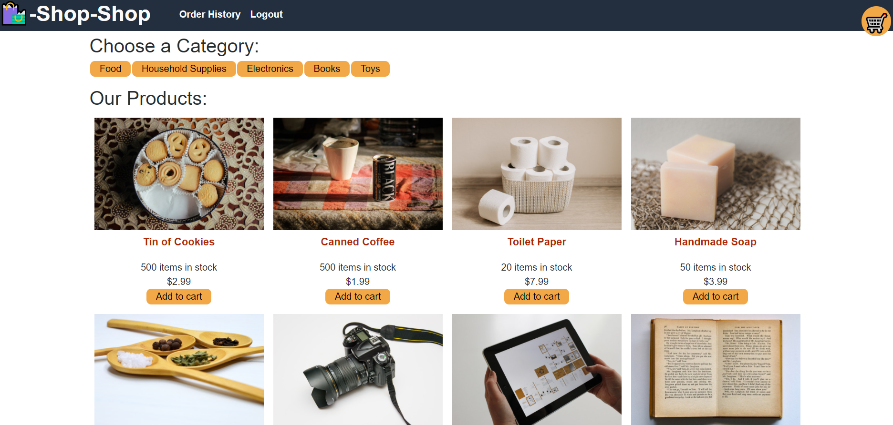

# Shop-Shop-Redux 

## Description 
USER STORY: 

AS a senior engineer working on an e-commerce platform

I WANT my platform to use Redux to manage global state instead of the Context API

SO THAT my website's state management is taken out of the React ecosystem

This application uses Redux to manage global state. User can register using the Signup page, and navigate to the Products page. Once there, user can select a category, choose a product, view details about it on the product page, and add or remove it from their shopping cart. Once done, the user can checkout by going to their shopping cart. 

Feel free to see it for yourself: 

[Click here to visit the deployed app!](https://vast-crag-03239.herokuapp.com/)

## Questions
 Github Username : melissabarrerafarias
  
  [Link to Github Profile](https://github.com/melissabarrerafarias)

  If you have any further questions or curiosities, feel free to contact me through email at melissabarrerafarias@gmail.com!